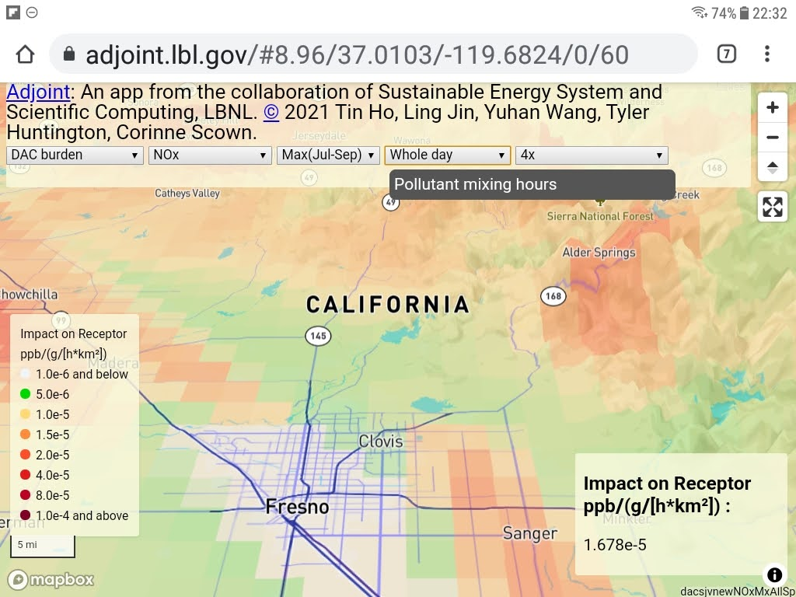

Adjoint
=======

An app from the collaboration of Sustainable Energy System and Scientific Computing, LBNL:
Tin Ho, Ling Jin, Yuhan Wang, Tyler Huntington, Corinne Scown

© 2021, see LICENSE

Proof of Concept.  Data are for demo purpose only.  

URL:
https://adjoint.lbl.gov

Dev URL: 
https://tin6150.github.io/adjoint/ 
https://tin6150.github.io/adjoint/adjoint_3D.html  # use ctrl + click to control pitch 
https://tin6150.github.io/adjoint/adjoint_3D.html#8.57/37.0007/-119.8629/0/63 

For 3D rendering, 
use Ctrl + mouse drag to change pitch

Thanks
======

A big shoutout to Mapbox.com for the generous free hosting tier!

